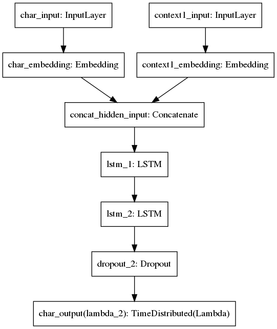

# ocrd_keraslm
    character-level language modelling using Keras

[](https://circleci.com/gh/OCR-D/ocrd_keraslm)

## Introduction

This is a tool for statistical _language modelling_ (predicting text from context) with recurrent neural networks. It models probabilities not on the word level but the _character level_ so as to allow open vocabulary processing (avoiding morphology, historic orthography and word segmentation problems). It manages a vocabulary of mapped characters, which can be easily extended by training on more text. Above that, unmapped characters are treated with underspecification.

In addition to character sequences, (meta-data) context variables can be configured as extra input. 

### Architecture

The model consists of:

0. an input layer: characters are represented as indexes from the vocabulary mapping, in windows of a number `length` of characters,
1. a character embedding layer: window sequences are converted into dense vectors by looking up the indexes in an embedding weight matrix,
2. a context embedding layer: context variables are converted into dense vectors by looking up the indexes in an embedding weight matrix, 
3. character and context vector sequences are concatenated,
4. a number `depth` of hidden layers: each with a number `width` of hidden recurrent units of _LSTM cells_ (Long Short-term Memory) connected on top of each other,
5. an output layer derived from the transposed character embedding matrix (weight tying): hidden activations are projected linearly to vectors of dimensionality equal to the character vocabulary size, then softmax is applied returning a probability for each possible value of the next character, respectively.



The model is trained by feeding windows of text in index representation to the input layer, calculating output and comparing it to the same text shifted backward by 1 character, and represented as unit vectors ("one-hot coding") as target. The loss is calculated as the (unweighted) cross-entropy between target and output. Backpropagation yields error gradients for each layer, which is used to iteratively update the weights (stochastic gradient descent).

This is implemented in [Keras](https://keras.io) with [Tensorflow](https://www.tensorflow.org/) as backend. It automatically uses a fast CUDA-optimized LSTM implementation (Nividia GPU and Tensorflow installation with GPU support, see below), both in learning and in prediction phase, if available.


### Modes of operation

Notably, this model (by default) runs _statefully_, i.e. by implicitly passing hidden state from one window (batch of samples) to the next. That way, the context available for predictions can be arbitrarily long (above `length`, e.g. the complete document up to that point), or short (below `length`, e.g. at the start of a text). (However, this is a passive perspective above `length`, because errors are never back-propagated any further in time during gradient-descent training.) This is favourable to stateless mode because all characters can be output in parallel, and no partial windows need to be presented during training (which slows down).

Besides stateful mode, the model can also be run _incrementally_, i.e. by explicitly passing hidden state from the caller. That way, multiple alternative hypotheses can be processed together. This is used for generation (sampling from the model) and alternative decoding (finding the best path through a sequence of alternatives).

### Context conditioning

Every text has meta-data like time, author, text type, genre, production features (e.g. print vs typewriter vs digital born rich text, OCR version), language, structural element (e.g. title vs heading vs paragraph vs footer vs marginalia), font family (e.g. Antiqua vs Fraktura) and font shape (e.g. bold vs letter-spaced vs italic vs normal) etc. 

This information (however noisy) can be very useful to facilitate stochastic modelling, since language has an extreme diversity and complexity. To that end, models can be conditioned on extra inputs here, termed _context variables_. The model learns to represent these high-dimensional discrete values as low-dimensional continuous vectors (embeddings), also entering the recurrent hidden layers (as a form of simple additive adaptation).

### Underspecification

Index zero is reserved for unmapped characters (unseen contexts). During training, its embedding vector is regularised to occupy a center position of all mapped characters (all other contexts), and the hidden layers get to see it every now and then by random degradation. At runtime, therefore, some unknown character (some unknown context) represented as zero does not disturb follow-up predictions too much.


## Installation

Required Ubuntu packages:

* Python (``python`` or ``python3``)
* pip (``python-pip`` or ``python3-pip``)
* virtualenv (``python-virtualenv`` or ``python3-virtualenv``)

Create and activate a virtualenv as usual.

If you need a custom version of ``keras`` or ``tensorflow`` (like [GPU support](https://www.tensorflow.org/install/install_sources)), install them via `pip` now.

To install Python dependencies and this module, then do:
```shell
make deps install
```
Which is the equivalent of:
```shell
pip install -r requirements.txt
pip install -e .
```

Useful environment variables are:
- ``TF_CPP_MIN_LOG_LEVEL`` (set to `1` to suppress most of Tensorflow's messages
- ``CUDA_VISIBLE_DEVICES`` (set empty to force CPU even in a GPU installation)


## Usage

This packages has two user interfaces:

### command line interface `keraslm-rate`

To be used with string arguments and plain-text files.

```shell
Usage: keraslm-rate [OPTIONS] COMMAND [ARGS]...

Options:
  --help  Show this message and exit.

Commands:
  train                           train a language model
  test                            get overall perplexity from language model
  apply                           get individual probabilities from language model
  generate                        sample characters from language model
  print-charset                   Print the mapped characters
  prune-charset                   Delete one character from mapping
  plot-char-embeddings-similarity
                                  Paint a heat map of character embeddings
  plot-context-embeddings-similarity
                                  Paint a heat map of context embeddings
  plot-context-embeddings-projection
                                  Paint a 2-d PCA projection of context embeddings
```

Examples:
```shell
keraslm-rate train --width 64 --depth 4 --length 256 --model model_dta_64_4_256.h5 dta_komplett_2017-09-01/txt/*.tcf.txt
keraslm-rate generate -m model_dta_64_4_256.h5 --number 6 "für die Wiſſen"
keraslm-rate apply -m model_dta_64_4_256.h5 "so schädlich ist es Borkickheile zu pflanzen"
keraslm-rate test -m model_dta_64_4_256.h5 dta_komplett_2017-09-01/txt/grimm_*.tcf.txt
```

### [OCR-D processor](https://github.com/OCR-D/core) interface `ocrd-keraslm-rate`

To be used with [PageXML](https://www.primaresearch.org/tools/PAGELibraries) documents in an [OCR-D](https://github.com/OCR-D/spec/) annotation workflow. Input could be anything with a textual annotation (`TextEquiv` on the given `textequiv_level`). The LM rater could be used for both quality control (without alternative decoding, using only each first index `TextEquiv`) and part of post-correction (with `alternative_decoding=True`, finding the best path among `TextEquiv` indexes).

```json
  "tools": {
    "ocrd-keraslm-rate": {
      "executable": "ocrd-keraslm-rate",
      "categories": [
        "Text recognition and optimization"
      ],
      "steps": [
        "recognition/text-recognition"
      ],
      "description": "Rate elements of the text with a character-level LSTM language model in Keras",
      "input_file_grp": [
        "OCR-D-OCR-TESS",
        "OCR-D-OCR-KRAK",
        "OCR-D-OCR-OCRO",
        "OCR-D-OCR-CALA",
        "OCR-D-OCR-ANY",
        "OCR-D-COR-CIS",
        "OCR-D-COR-ASV"
      ],
      "output_file_grp": [
        "OCR-D-COR-LM"
      ],
      "parameters": {
        "model_file": {
          "type": "string",
          "format": "uri",
          "content-type": "application/x-hdf;subtype=bag",
          "description": "path of h5py weight/config file for model trained with keraslm",
          "required": true,
          "cacheable": true
        },
        "textequiv_level": {
          "type": "string",
          "enum": ["region", "line", "word", "glyph"],
          "default": "glyph",
          "description": "PAGE XML hierarchy level to evaluate TextEquiv sequences on"
        },
        "alternative_decoding": {
          "type": "boolean",
          "description": "whether to process all TextEquiv alternatives, finding the best path via beam search, and delete each non-best alternative",
          "default": true
        },
        "beam_width": {
          "type": "number",
          "format": "integer",
          "description": "maximum number of best partial paths to consider during search with alternative_decoding",
          "default": 100
        }
      }
    }
  }
```

Examples:
```shell
make deps-test # installs ocrd_tesserocr
make test/assets # downloads GT, imports PageXML, builds workspaces
ocrd workspace -d ws1 clone -a test/assets/kant_aufklaerung_1784/mets.xml
cd ws1
ocrd-tesserocr-segment-region -I OCR-D-IMG -O OCR-D-SEG-BLOCK
ocrd-tesserocr-segment-line -I OCR-D-SEG-BLOCK -O OCR-D-SEG-LINE
ocrd-tesserocr-recognize -I OCR-D-SEG-LINE -O OCR-D-OCR-TESS-WORD -p '{ "textequiv_level" : "word", "model" : "Fraktur" }'
ocrd-tesserocr-recognize -I OCR-D-SEG-LINE -O OCR-D-OCR-TESS-GLYPH -p '{ "textequiv_level" : "glyph", "model" : "deu-frak" }'
# get confidences and perplexity:
ocrd-keraslm-rate -I OCR-D-OCR-TESS-WORD -O OCR-D-OCR-LM-WORD -p '{ "model_file": "model_dta_64_4_256.h5", "textequiv_level": "word", "alternative_decoding": false }'
# also get best path:
ocrd-keraslm-rate -I OCR-D-OCR-TESS-GLYPH -O OCR-D-OCR-LM-GLYPH -p '{ "model_file": "model_dta_64_4_256.h5", "textequiv_level": "glyph", "alternative_decoding": true, "beam_width": 10 }'
```

## Testing

```shell
make deps-test test
```
Which is the equivalent of:
```shell
pip install -r requirements_test.txt
test -e test/assets || test/prepare_gt.bash test/assets
test -f model_dta_test.h5 || keraslm-rate train -m model_dta_test.h5 test/assets/*.txt
keraslm-rate test -m model_dta_test.h5 test/assets/*.txt
python -m pytest test $(PYTEST_ARGS)
```

Set `PYTEST_ARGS="-s --verbose"` to see log output (`-s`) and individual test results (`--verbose`).
